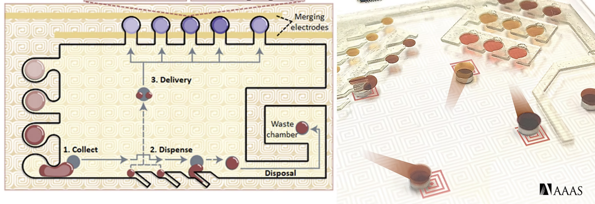

# Interconnected and Integrated Bioelectronics Lab (I²BL) @ UCLA

  

## About I²BL

The Interconnected and Integrated Bioelectronics Lab (I²BL) at UCLA is a cutting-edge research facility dedicated to advancing the field of bioelectronics and medical device development. Our lab focuses on creating innovative solutions that bridge the gap between engineering and medicine.

## Ferrobtic Group for Accessible and Adaptable Automated Viral Testing

### Mission Statement
Our mission is to realize personalized medicine for everyone. We create new bioelectronics to:

1. **Engineer Materials**: Develop materials with specialized properties (e.g., soft, strain-insensitive, stimuli-responsive)
2. **Develop Sensing Methodologies**: Create micro/nanoscale actuation and sensing methodologies to control, isolate, and sense a spectrum of biomarkers (e.g., electrochemical sensors to measure metabolites, electrolytes, nutrients, hormones, and pharmaceuticals)
3. **Fabricate Platforms**: Optimize microfluidic PCB-based platforms to interface with biological entities such as biofluid and tissue

### Research Approach
In our approach, we emphasize solutions that are:
- **Simple**: Easy to understand and implement
- **Low-Cost**: Affordable and accessible
- **Scalable**: Can be implemented in various settings
- **Innovative**: Providing new functionalities to bypass performance boundaries of conventional biomedical tools

## Research Areas

### Biomaterials Development
- **Biocompatible Materials**: Creating materials that work harmoniously with biological systems
- **Electroactive Polymers**: Developing materials that respond to electrical stimulation
- **Tissue Engineering**: Creating scaffolds for tissue regeneration
- **Biodegradable Materials**: Ensuring materials break down safely in the body

### Sensing Technologies
- **Electrochemical Sensors**: Detecting various biomarkers in biological fluids
- **Microfluidic Systems**: Creating precise fluid control systems
- **Biosensors**: Developing sensors that respond to biological molecules
- **Wearable Devices**: Creating comfortable, long-term monitoring solutions

### Medical Device Development
- **Diagnostic Platforms**: Creating accessible testing solutions
- **Therapeutic Devices**: Developing treatment delivery systems
- **Monitoring Systems**: Creating continuous health monitoring solutions
- **Point-of-Care Devices**: Bringing testing closer to patients

## Current Projects

### Automated Viral Testing
Our flagship project focuses on developing accessible and adaptable automated viral testing platforms that can be deployed in various settings, from clinical laboratories to remote locations.

### Biomarker Detection
We're developing sensors to detect a wide range of biomarkers including:
- **Metabolites**: Glucose, lactate, and other metabolic markers
- **Electrolytes**: Sodium, potassium, and other essential ions
- **Nutrients**: Vitamins and essential nutrients
- **Hormones**: Various hormonal markers
- **Pharmaceuticals**: Drug monitoring and therapeutic levels

### Microfluidic Systems
Our microfluidic PCB-based platforms enable:
- **Precise Control**: Accurate manipulation of biological fluids
- **Integration**: Seamless connection with electronic systems
- **Scalability**: Easy production and deployment
- **Reliability**: Consistent performance in various conditions

## Clinical Applications

### Personalized Medicine
By integrating our solutions into autonomous bioanalytical platforms and collaborating closely with prominent clinical experts and medical centers, we hope to translate our technologies in clinical applications.

### Patient Care
Our technologies aim to:
- **Improve Diagnosis**: Faster and more accurate diagnostic capabilities
- **Enhance Treatment**: Better monitoring and delivery of therapies
- **Reduce Costs**: More affordable healthcare solutions
- **Increase Access**: Bringing advanced diagnostics to underserved areas

## Collaboration and Partnerships

### Academic Partnerships
We collaborate with various departments and institutions to advance our research:
- **UCLA Engineering**: Electrical, mechanical, and materials engineering
- **UCLA Medical School**: Clinical expertise and patient access
- **Other Universities**: National and international collaborations

### Industry Partnerships
We work with industry partners to:
- **Commercialize Technologies**: Bringing innovations to market
- **Scale Production**: Manufacturing solutions at scale
- **Clinical Validation**: Testing in real-world settings
- **Regulatory Compliance**: Meeting healthcare standards

## Future Directions

### Technology Development
We plan to expand our research in:
- **Advanced Materials**: Next-generation biomaterials
- **Smart Devices**: Intelligent diagnostic and therapeutic systems
- **Integration**: Seamless connection between devices and healthcare systems
- **Automation**: Fully automated diagnostic and treatment platforms

### Clinical Translation
Our goal is to:
- **Validate Technologies**: Prove effectiveness in clinical trials
- **Obtain Approvals**: Meet regulatory requirements
- **Deploy Solutions**: Bring technologies to patients
- **Monitor Impact**: Track improvements in patient outcomes

## Get Involved

### For Students
We welcome students interested in:
- **Research Opportunities**: Undergraduate and graduate research positions
- **Learning**: Understanding the intersection of engineering and medicine
- **Innovation**: Contributing to cutting-edge medical technology development
- **Career Development**: Building skills for future careers in medical technology

### For Collaborators
We seek partnerships with:
- **Clinical Researchers**: Healthcare professionals interested in new technologies
- **Industry Partners**: Companies looking to commercialize medical innovations
- **Funding Organizations**: Organizations supporting medical technology development
- **Patient Advocates**: Representatives of patient communities

---

**Related Pages:**
- [[Projects]] - My engineering projects in medical technology
- [[Medical Research]] - My medical research work
- [[Resume]] - My professional background and experience

**Contact Information:**
For questions about I²BL or collaboration opportunities, please contact me at michaelshara@g.ucla.edu
