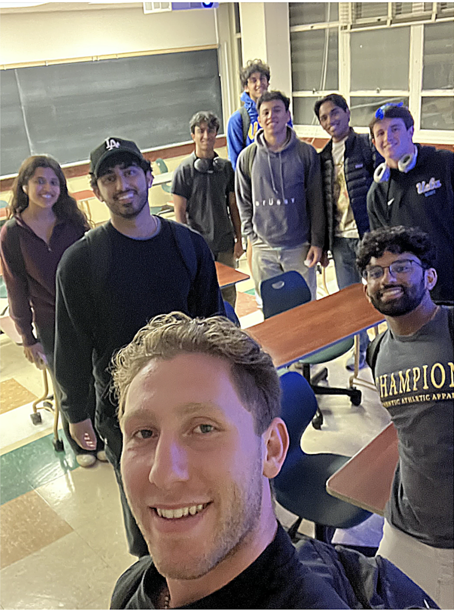

  

Hello! My name is Michael Shara - I am an Electrical Engineering student and researcher at UCLA interested in pursuing an MD in Surgery while continuing my involvement in researching new technologies in the medical field. My professional interests include developing accessible platforms for rapid and automated diagnostic testing, as well as surgical solutions to optimize patient recovery and performance in the field of sports medicine. I plan to use my experience is Electrical Engineering in relation to biological sciences, along with my personal experiences in fast pace scientific research, athletic perforce, and community settings, to remold how patients  evaluate their health and performance in their daily lives - especially high performance athletes where the ultimate goal is to strategically minimize injury and optimize recovery solutions.

Welcome to my personal volt where I publish progress of my projects and learnings that are related to my goals. 

## 🏥 Research & Medical Work

<!-- Row 1 -->

  <!-- I2BL Lab -->
  

    
[[I2BL|Interconnected and Integrated Bioelectronics Lab (I²BL) @ UCLA]]

    
  

  <!-- Divider -->
  

  <!-- Crusade Sports Medicine -->
  

    
[[Crusade Sports Medicine|Crusade Sports Medicine]]

    
  

  

  <!-- Crusade Journal -->
  

    
[[Crusade Journal|Crusade Journal of Sports Medicine]]

    
  

<!-- Row 2 -->

  <!-- Medical Observations -->
  

    
[[Medical Research|Medical Observations & Research]]

    
  

  

  <!-- Projects -->
  

    
[[Projects|Engineering Projects & Research]]

    
  

  

  <!-- Resume -->
  

    
[[Resume|Resume & Experience]]

    
  

## 🏃‍♂️ Athletics & Personal

<!-- Row 3 -->

  <!-- Athletics -->
  

    
[[Athletics|Athletics]]

    
  

  

  <!-- MYA -->
  

    
[[MYA|Maronite Youth Adults (MYA)]]

    
  

  

  <!-- Music -->
  

    
[[Music|Music]]

    
  

  

  <!-- Surfing -->
  

    
[[Surfing|Surfing]]

    
  

    Please see my attached [[Resume|RESUME]] - you can reach me at  
    <a href="mailto:michaelshara@g.ucla.edu">michaelshara@g.ucla.edu</a> if you have any questions!

---

## 🏥 Interconnected and Integrated Bioelectronics Lab (I²BL) @ UCLA

### Ferrobtic Group for Accessible and Adaptable Automated Viral Testing

  

Our mission is to realize personalized medicine for everyone. We create new bioelectronics to: 
1.  Engineer materials with specialized properties (e.g., soft, strain-insensitive, stimuli-responsive).
2.  Develop micro/nanoscale actuation and sensing methodologies to control, isolate, and sense a spectrum of biomarkers (e.g., electrochemical sensors to measure metabolites, electrolytes, nutrients, hormones, and pharmaceuticals).
3.  Fabricate and optimize microfluidic PCB-based platform to interface with biological entities such as biofluid and tissue. 

In our approach, we emphasize solutions that are simple, low-cost, and scalable, all while providing new functionalities to bypass performance boundaries of conventional biomedical tools. 

By integrating these solutions into autonomous bioanalytical platforms and collaborating closely with prominent clinical experts and medical centers, we hope to translate our technologies in clinical applications.

**Learn more about my work at I²BL: [[I2BL]]**

---

## 🏥 Crusade Sports Medicine

    
    

Visit my [Crusade Sports Medicine, Non-Profit Organization & Research Journal](https://www.crusadezone.com/) to see my work on researching sports medicine and developing a program to educate student-athlete's on how hit target performance goals based on our science-based meta analysis and clinical research.

I co-founded crusade to cultivate a community of undergraduate student-athletes who are passionate about researching innovation in the sports medicine field, as well as educating other student-athletes on taking their performance to the next level.

  

### My Team

  

### My Crusade Journal Publications
- [[Zone Training for Endurance Athletes]]

**Learn more about Crusade: [[Crusade Sports Medicine]]**

---

## 🏥 Medical Observations & Research

Through my Orthopedic Surgery Shadowing, I have been shadowing in the operating room and clinic. While shadowing in the Operating room, I prepare with thorough literature reviews on every surgical case to understand biomechanical principles, and biological structures for the respective cases. Before surgeries, I also observe preoperative imaging and nerve blocking techniques with the anesthesiologist.

You can view my [[Medical Observations and Research]].

**Explore my medical research: [[Medical Research]]**

---

## 🔬 Engineering Projects & Research

- [[Infrared Sensor Proportional-Derivative Controller]]
- [[Wearable Sensing Device]]
- [[Biocompatible, Biodegradable, and Electroactive Polyurethane-Urea Elastomers with Tunable Hydrophilicity for Skeletal Muscle Tissue Engineering]]

**View all my projects: [[Projects]]**

---

## 🏒 Athletics

### International Ice Hockey Federation (IIHF) - Team Lebanon Men's National Ice Hockey, Defenseman (Captain)

- Invited to join Team Lebanon IIHF: June 2023 Arab Cup in Kuwait and July 2023 Int'l Games vs Greece in Montreal.
- Gold Medal champions of the 2023 Arab Cup.
- Voted Captain by Lebanese Ice Hockey Federation

    
    

### British Columbian Hockey League (BCHL) - Merritt Centennials, Defenseman
- 60 game regular season schedule, daily on-ice and and off-ice training & conditioning
- Awarded The Joe Tennant Most Dedicated Player Trophy

    
    

 
    <strong>READ MERRITT CENTENNIALS ARTICLE ABOUT MY SIGNING 
        <a href="https://www.merrittcentennials.ca/centennials-sign-shara-for-the-2022-23-season" target="_blank" 
           style="color: #FFFDD0; text-decoration: underline; font-weight: 900;">HERE</a> 
    </strong> 

  

 
    <strong>QUOTE FROM THIS ARTICLE:</strong> 
    
 
        Shara is described as an aggressive and detailed Defenceman that plays hard every single shift, he has the skating ability to push the play offensively and can log big minutes due to being in incredible physical condition. The Cents' staff believe Shara will be a leader on and off the ice immediately and will be relied on in key situations. 
    
 
    
 
        "I am looking forward to playing for the Cents – I love the Merritt community and culture. It's a great environment for working hard alongside my teammates and coaches, and I'm excited to begin the season." – Michael Shara. 
    
 

### BCHL Season Highlights:
![[homeReferences/michaelSharaBCHL.mp4|michaelSharaBCHL]]

**Learn more about my athletic career: [[Athletics]]**

---

## 🎵 Music

### Sound 404 Classic Rock Band

  

**Learn more about my music: [[Music]]**

---

## 🏄‍♂️ Surfing

  

**Learn more about my surfing: [[Surfing]]**
