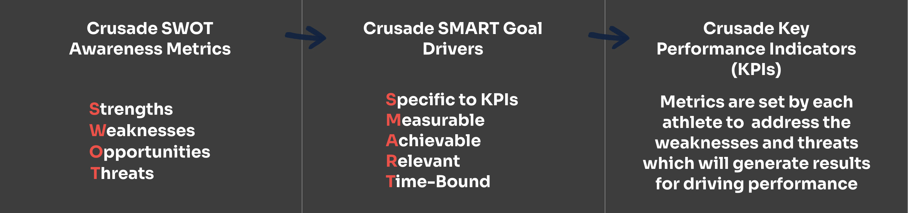
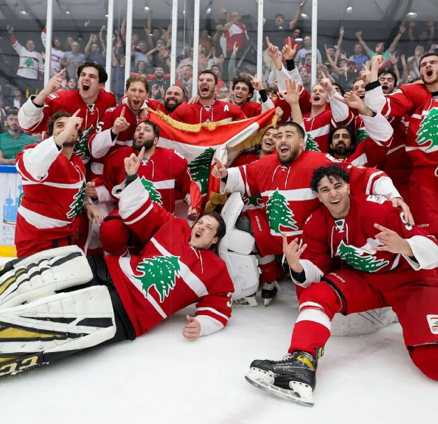
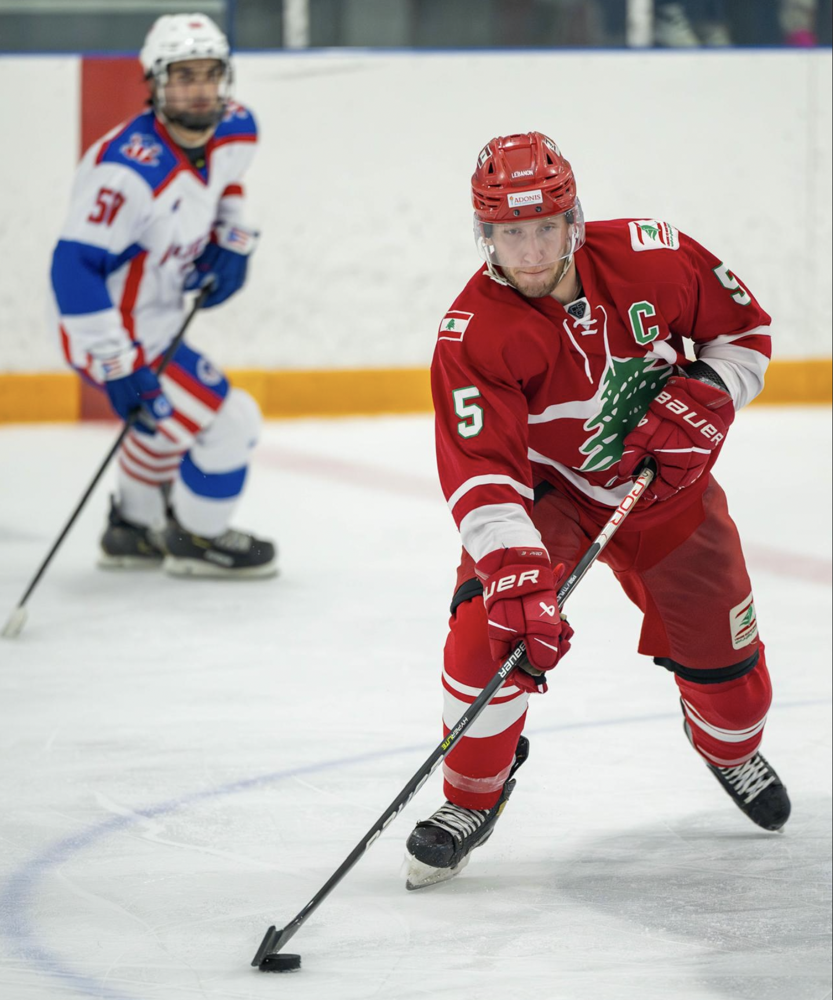
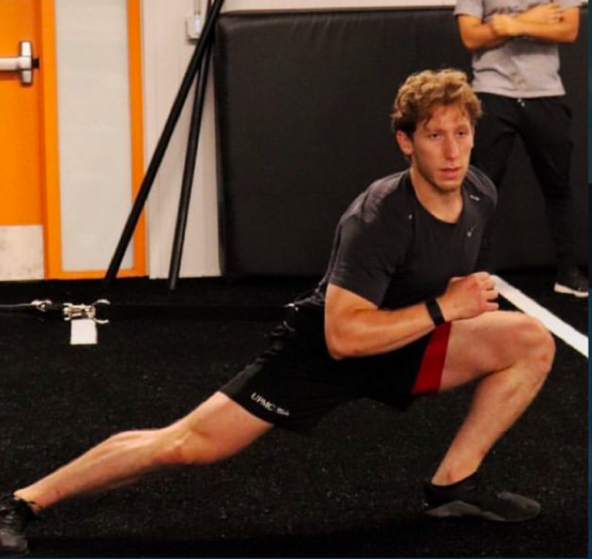
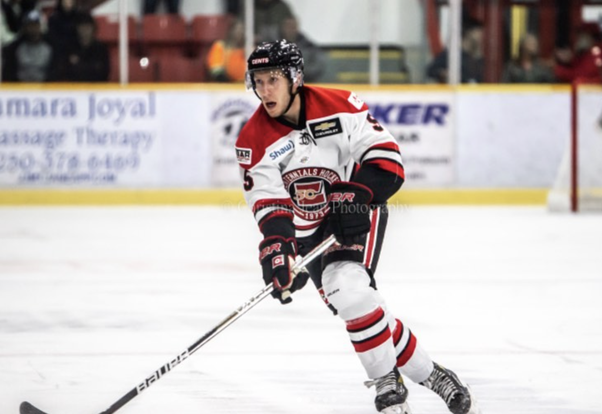
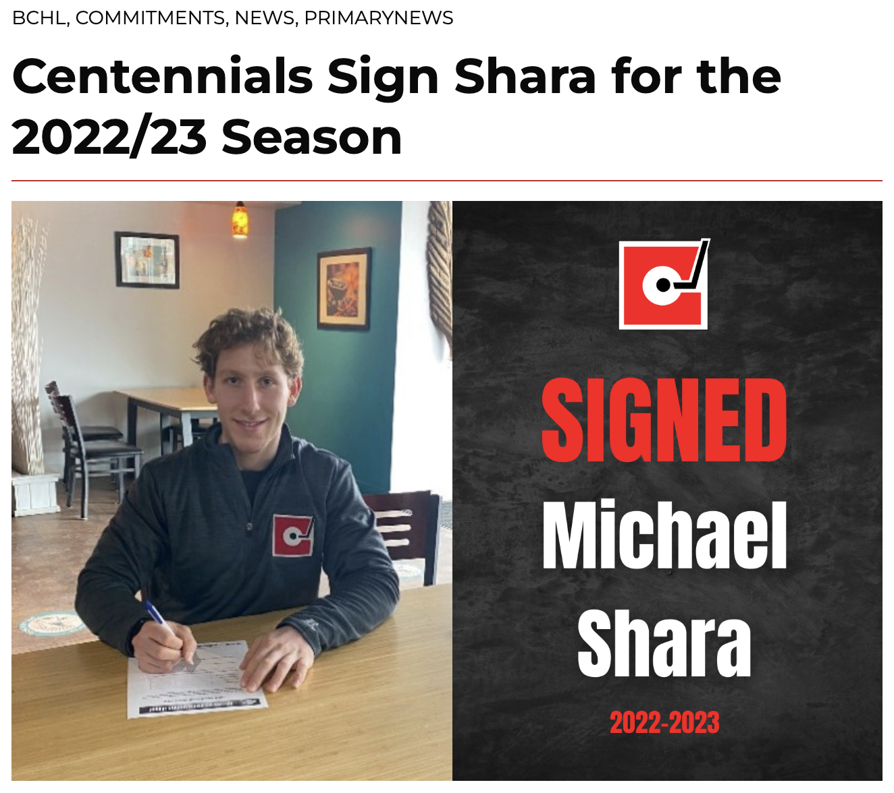
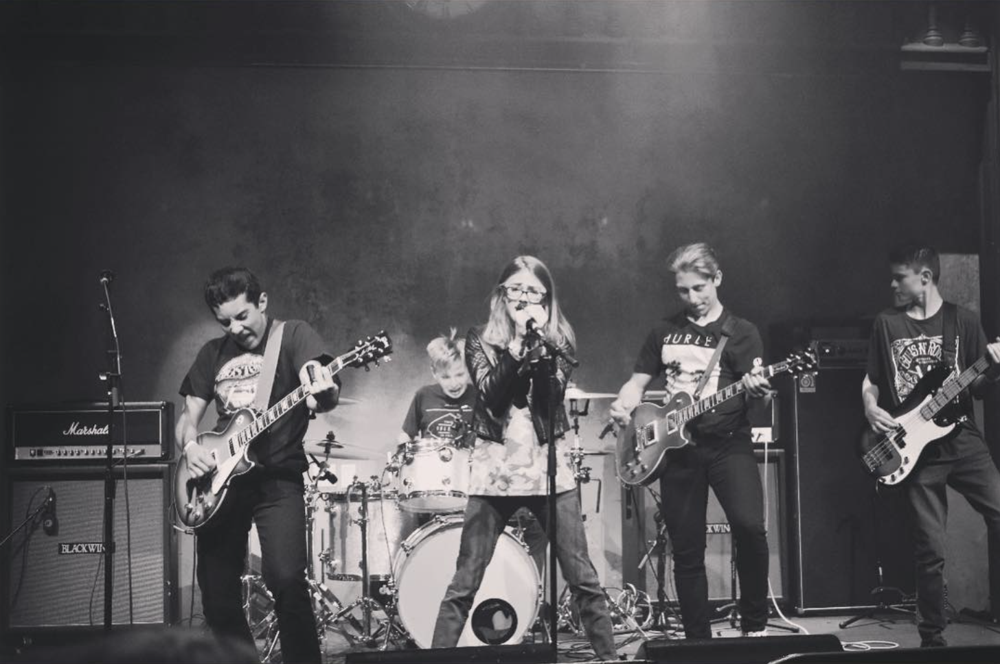

 

  

Hello! My name is Michael Shara - I am an undergraduate Electrical Engineering student and researcher interested in developing medical devices and treatments that provide innovative surgical, therapeutic, and diagnostic techniques. I plan to use Electrical Engineering to advance patient care through collaborative research and hands-on clinical experience. I am actively seeking opportunities to learn, contribute, and build skills at the intersection of engineering and medicine, with a strong focus on gaining clinical experience to support my goal of applying to medical school.

Welcome to my personal volt where I publish progress of my projects and learnings that are related to my goals. 

    Please see my attached <a href="Resume/Resume" target="_blank">RESUME</a> - you can reach me at  
    <a href="mailto:michaelshara@g.ucla.edu">michaelshara@g.ucla.edu</a> if you have any questions!

<h1 style="text-align: center;">Crusade Sports Medicine</h1>

    
    

Visit my <a href="https://www.crusadezone.com/" target="_blank">Crusade Sports Medicine, Non-Profit Organization & Research Journal</a> to see my work on researching sports medicine and developing a program to educate student-athlete’s on how hit target performance goals based on our science-based meta analysis and clinical research.

I co-founded crusade to cultivate a community of undergraduate student-athletes who are passionate about researching innovation in the sports medicine field, as well as educating other student-athletes on taking their performance to the next level.

  

## My Crusade Journal Publications
 - [[Zone Training for Endurance Athletes]]

<h1 style="text-align: center;">Medical Observations</h1>
Through my Orthopedic Surgery Shadowing, I have been shadowing in the operating room and clinic. While shadowing in the Operating room, I prepare with thorough literature reviews on every surgical case to understand biomechanical principles, and biological structures for the respective cases. Before surgeries, I also observe preoperative imaging and nerve blocking techniques with the anesthesiologist.

I have gathered a list of my [[Medical Observations]].

<h1 style="text-align: center;">Projects & Research</h1>

- [[Infrared Sensor Proportional-Derivative Controller]]
- [[Wearable Sensing Device]]
- [[Biocompatible, Biodegradable, and Electroactive Polyurethane-Urea Elastomers with Tunable Hydrophilicity for Skeletal Muscle Tissue Engineering]]

<h1 style="text-align: center;">Athletics</h1>

## International Ice Hockey Federation (IIHF) - Team Lebanon Men's National Ice Hockey, Defenseman (Captain)

- Invited to join Team Lebanon IIHF: June 2023 Arab Cup in Kuwait and July 2023 Int’l Games vs Greece in Montreal.
- Gold Medal champions of the 2023 Arab Cup.
- Voted Captain by Lebanese Ice Hockey Federation

    
    

## British Columbian Hockey League (BCHL) - Merritt Centennials, Defenseman
- 60 game regular season schedule, daily on-ice and and off-ice training & conditioning

- Awarded The Joe Tennant Most Dedicated Player Trophy

    
    

 
    <strong>READ MERRITT CENTENNIALS ARTICLE ABOUT MY SIGNING 
        <a href="https://www.merrittcentennials.ca/centennials-sign-shara-for-the-2022-23-season" target="_blank" 
           style="color: #FFFDD0; text-decoration: underline; font-weight: 900;">HERE</a> 
    </strong> 

 
     

 
    <strong>QUOTE FROM THIS ARTICLE:</strong> 
    
 
        Shara is described as an aggressive and detailed Defenceman that plays hard every single shift, he has the skating ability to push the play offensively and can log big minutes due to being in incredible physical condition. The Cents’ staff believe Shara will be a leader on and off the ice immediately and will be relied on in key situations. 
    
 
    
 
        “I am looking forward to playing for the Cents – I love the Merritt community and culture. It’s a great environment for working hard alongside my teammates and coaches, and I’m excited to begin the season.” – Michael Shara. 
    
 

### BCHL Season Highlights:
![[homeReferences/michaelSharaBCHL.mp4|michaelSharaBCHL]]

<h1 style="text-align: center;">Music</h1>

## Sound 404 Classic Rock Band

  

