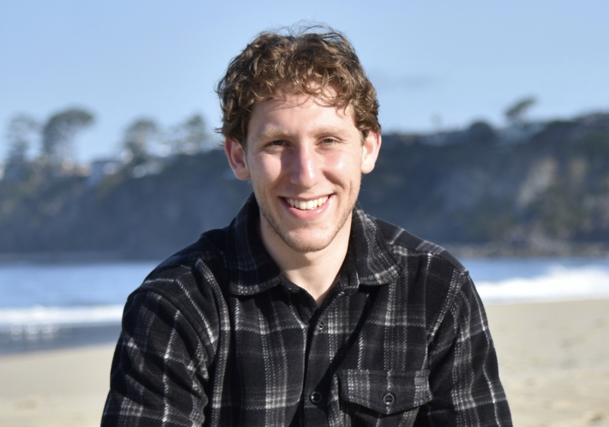

 

  

Hello! My name is Michael Shara - I am an undergraduate Electrical Engineering student and researcher interested in developing medical devices and treatments that provide innovative surgical, therapeutic, and diagnostic techniques. I plan to use Electrical Engineering to advance patient care through collaborative research and hands-on clinical experience. I am actively seeking opportunities to learn, contribute, and build skills at the intersection of engineering and medicine, with a strong focus on gaining clinical experience to support my goal of applying to medical school.

Welcome to my personal volt where I publish progress of my projects and learnings that are related to my goals. 

My resume can be found [here](Resume/Resume) - please reach me at [michaelshara@g.ucla.edu](mailto:michaelshara@g.ucla.edu) if you have any questions! 

# Crusade Sports Medicine
Visit my <a href="https://www.crusadezone.com/" target="_blank">Crusade Sports Medicine, Non-Profit Organization & Research Journal</a> to see my work on researching sports medicine and developing a programs guide student-athlete’s to hit target performance goals based on our science-based meta analysis research.

I co-founded crusade to cultivate a community of undergraduate student-athletes who are passionate about researching innovation in the sports medicine field, as well as educating other student-athletes on taking their performance to the next level.